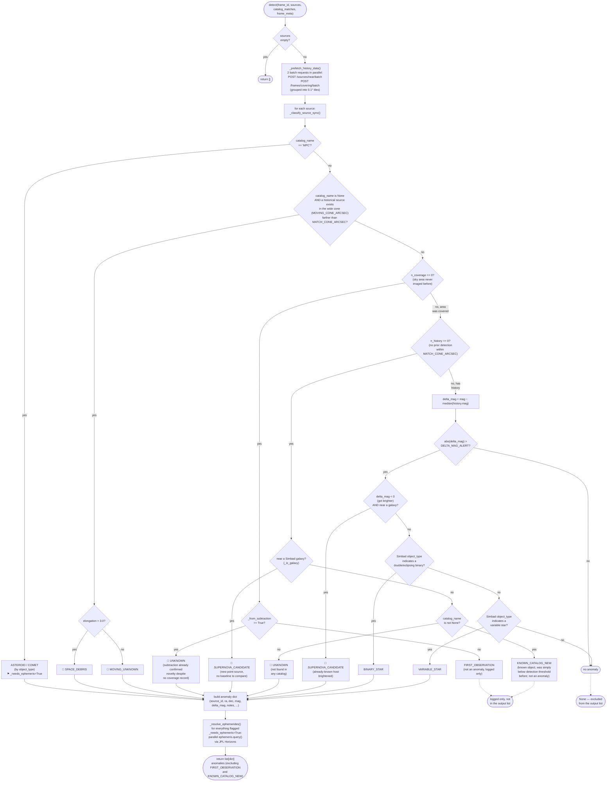

# Anomaly Detector Mechanics (`modules/anomaly_detector.py`)

This document explains in detail how `modules/anomaly_detector.py` works — the
pipeline's central "science" component, which compares sources detected in a frame
against observation history and classifies them into anomaly types.

For the overall pipeline context and the full module list, see
[../CLAUDE.md](../CLAUDE.md) and [../README.md](../README.md).

---

## Entry point

```python
await anomaly_detector.detect(frame_id, sources, catalog_matches, frame_meta) -> list[dict]
```

Called from `pipeline.py` after `photometry.measure()`, and after
`api_client.post_sources()` has returned `source_ids` for each source (see Steps 12–13
in `CLAUDE.md`). The input source list has already been through:

- plate solving and source extraction (`astrometry.py`),
- optional image subtraction (`subtraction.py`, candidates flagged `_from_subtraction=True`),
- catalog cross-matching (`catalog_matcher.py`: Simbad, Gaia DR3, 2MASS, Pan-STARRS DR1, MPC),
- photometry (`photometry.py`, `mag` field, merged by `pipeline.py` from `mag_calibrated`/`mag_instrumental`).

The output is a list of anomaly dicts ready to be sent to `POST /frames/{id}/anomalies`.
`FIRST_OBSERVATION` and `KNOWN_CATALOG_NEW` are **never included** in this list — they
are only logged (`logger.debug`), since they are not an actionable signal.

---

## Batch API prefetch

A key architectural feature: instead of one HTTP request per source (`O(N)`), the
module makes **exactly two** batch requests for the entire frame (`O(1)`):

1. `POST /sources/near/batch` — historical sources near every position.
2. `POST /frames/covering/batch` — which positions were already covered by earlier frames.

Both requests group source coordinates into `0.1°×0.1°` tiles (`_tile_key()`, ~6
arcminutes) so nearby sources reuse the same result instead of issuing duplicate
queries. Both requests run concurrently via `asyncio.gather`.

Important: **history is fetched for every source without exception**, including
already catalog-matched ones — it's needed not only to detect position shifts (movers)
but also to compute `delta_mag` for already-known variable/binary stars and galaxies
(see resolved Known Issue #6 in `CLAUDE.md` — an earlier revision forced history to
empty for catalog-matched sources, which made `VARIABLE_STAR`/`BINARY_STAR`/the
"brightening" branch of `SUPERNOVA_CANDIDATE` permanently unreachable).

If both batch requests come back empty, it's either the very first frame of this sky
area, or an API failure; a warning is logged.

---

## Process diagram



🔔 — the type is a member of `_ALERT_TYPES` and is logged with `logger.warning`
("ALERT") rather than `logger.info`/`logger.debug`.

---

## Classification priority (important!)

Branches are checked in a fixed order inside `_classify_source_sync()` — as soon as
one condition matches, the function returns and no further checks run:

1. **MPC match** — `catalog_name == "MPC"` → `ASTEROID`/`COMET`, regardless of history
   or coverage.
2. **Unmatched position-shifted source** — `catalog_name is None` and the wide cone
   (`MOVING_CONE_ARCSEC`, default 120″) found a historical position farther than
   `MATCH_CONE_ARCSEC` (5″) → `MOVING_UNKNOWN` (elongation ≤ 3.0) or `SPACE_DEBRIS`
   (elongation > 3.0, fast trail).
3. **Stationary sources** — decided next by coverage (`coverage`) and local history
   (`history`, `MATCH_CONE_ARCSEC` cone):
   - no coverage at all → `FIRST_OBSERVATION` (not an anomaly), except when
     `_from_subtraction=True` → then `UNKNOWN` (subtraction already proved novelty at
     the pixel level, so missing API coverage doesn't override that);
   - covered, no history, near a galaxy (Simbad OTYPE) → `SUPERNOVA_CANDIDATE`;
   - covered, no history, not in any catalog → `UNKNOWN`;
   - covered, no history, in a catalog (not a galaxy) → `KNOWN_CATALOG_NEW` (not an anomaly);
   - has history → compare `delta_mag = mag − median(history.mag)` against
     `DELTA_MAG_ALERT` (default 0.5). If the threshold is exceeded:
     - a change near a galaxy only counts when the source **brightened**, i.e.
       `delta_mag < 0` → `SUPERNOVA_CANDIDATE` (checked first — takes priority over
       binary/variable stars);
     - otherwise, if Simbad classifies the object as a double/eclipsing binary
       (`**`, `EB`, `SB`) → `BINARY_STAR`;
     - otherwise, if Simbad classifies the object as a variable
       (`V*`, `RR`, `Cep`, `BY`, `RS`, `Ell`, `bL`) → `VARIABLE_STAR`;
     - otherwise — no anomaly.

Table of Simbad OTYPE substrings used by the classifiers:

| Function | OTYPE substrings |
|---|---|
| `_is_variable_star` | `V*`, `RR`, `Cep`, `BY`, `RS`, `Ell`, `bL` |
| `_is_binary_star` | `**`, `EB`, `SB` |
| `_is_galaxy` | `G`, `SFG`, `AGN`, `GiG` |

---

## Anomaly type table

| `anomaly_type` | When assigned | Alert? |
|---|---|---|
| `FIRST_OBSERVATION` | Sky area never observed before | No (logged only, not returned) |
| `KNOWN_CATALOG_NEW` | Not in history, but found in a catalog | No (logged only, not returned) |
| `VARIABLE_STAR` | Has history, Δmag > `DELTA_MAG_ALERT`, Simbad variable | No (logged) |
| `BINARY_STAR` | Has history, Δmag > `DELTA_MAG_ALERT`, Simbad binary | No (logged) |
| `ASTEROID` | Matched in MPC/SkyBot, type "asteroid" | No (logged + ephemeris) |
| `COMET` | Matched in MPC/SkyBot, type "comet" | No (logged + ephemeris) |
| `SUPERNOVA_CANDIDATE` | New point source near a galaxy with no history, **or** an already-known galaxy brightening beyond Δmag | **Yes** |
| `MOVING_UNKNOWN` | Position-shifted source, not in MPC, elongation ≤ 3.0 | **Yes** |
| `SPACE_DEBRIS` | Position-shifted source, not in MPC, elongation > 3.0 | **Yes** |
| `UNKNOWN` | New source outside any catalog in a covered area, or detected via image subtraction regardless of coverage | **Yes** |

The list is fixed as `AnomalyType(str, Enum)` and must match
`AnomalyModel::ALLOWED_TYPES`/the `ENUM` constraint on the `observatory-api` side — the
two lists are kept in sync by hand (see `CLAUDE.md`, "Anomaly Types Reference" section).

---

## Ephemeris resolution

After all sources are classified, `_resolve_ephemerides()` concurrently
(`asyncio.gather`) calls `ephemeris.query(designation, obs_time)` for every anomaly
flagged `_needs_ephemeris=True` (i.e. only `ASTEROID`/`COMET`) and fills in the
`ephemeris` field. The internal `_needs_ephemeris` sentinel is removed from the final
dicts before they're returned.

---

## Returned item format

```python
{
    "anomaly_type":    AnomalyType,       # see table above
    "source_id":       str | None,        # sources.id, from _source_id (see pipeline.py Step 12)
    "ra":              float,
    "dec":             float,
    "magnitude":       float | None,
    "delta_mag":       float | None,      # None for MPC / moving sources
    "mpc_designation": str | None,
    "ephemeris":       dict | None,       # filled by _resolve_ephemerides()
    "notes":           str,               # human-readable explanation
}
```

---

## Error handling

- A failure in the batch history/coverage prefetch (`_prefetch_history_data`) is
  caught entirely — classification continues with empty dicts (every source falls
  through to `FIRST_OBSERVATION`/no anomaly rather than crashing the frame).
- A failure classifying a single source (`_classify_source_sync`) is caught at the
  loop level in `detect()` — the rest of the frame's sources are still processed normally.

---

## Known limitations

- There is no magnitude threshold for `UNKNOWN` — very faint sources (mag > 20) that
  aren't even in Pan-STARRS DR1 are still unconditionally flagged `UNKNOWN`. A
  `FAINT_UNCATALOGUED` classification is not implemented yet (see Known Issues #1 in
  [../CLAUDE.md](../CLAUDE.md)).
- Both "galaxy" branches (`SUPERNOVA_CANDIDATE`) use the same `MATCH_CONE_ARCSEC`
  radius (5″ by default) — there is no separate, wider radius for extended galaxy disks.

The full history of resolved issues in this module (history not queried for
catalog-matched sources, `source_id` not propagated to anomalies, etc.) is in the
"Known Issues & Future Improvements" section of [../CLAUDE.md](../CLAUDE.md).
